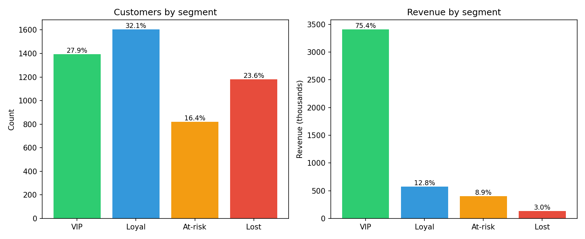

# Customer Segmentation with RFM — CRM Analytics & Revenue Prioritization



Portfolio project for **junior Data Analyst** and **CRM Analyst** roles.

This project starts from order-level data and turns it into a clear CRM segmentation: who drives revenue, who should be protected, who is at risk, and where marketing teams should avoid wasting budget.

---

## Executive summary

This RFM analysis shows a strong revenue concentration pattern.

From this run:

- **5,000** customers analyzed
- **45,356** orders processed
- **4,522,014.07** total revenue
- **VIP customers** represent **27.9%** of customers
- **VIP customers** generate **75.4%** of total revenue
- **Lost customers** represent **23.62%** of customers
- **Lost customers** generate only **2.95%** of total revenue

Main business conclusion: CRM should not treat all customers equally. The priority is to protect VIP customers, recover At-risk customers before they become Lost, grow Loyal customers with structured journeys, and avoid overspending on low-value reactivation.

---

## Story at a glance

All figures below come from the same run as the tables and charts in `outputs/`.

| Question | Answer from the data |
|---|---|
| How big is the base? | **5,000** customers, **45,356** orders, **4,522,014.07** revenue |
| Who carries revenue? | **VIP**: **1,395** customers, **27.9%** of base, **75.4%** of revenue |
| Who is large but light on revenue? | **Lost**: **1,181** customers, **23.62%** of base, **2.95%** of revenue |
| Who should CRM worry about before they become Lost? | **At-risk**: **819** customers, **16.38%** of base, **8.89%** of revenue |
| Who is the “grow the middle” group? | **Loyal**: **1,605** customers, **32.1%** of base, **12.75%** of revenue |

The core CRM story:

> **27.9%** of customers generate **75.4%** of revenue, while **23.62%** of customers generate only **2.95%** of revenue.

This is why segmentation matters.

---

## Business problem

When retention and CRM actions are not tied to customer value and lifecycle stage, teams often make three mistakes:

- They send the same campaigns to everyone.
- They under-serve high-value customers.
- They spend too much money trying to reactivate low-value dormant profiles.

This project answers four practical questions:

1. Who already drives most revenue?
2. Who is historically valuable but becoming inactive?
3. Who is the broad engaged middle that can be grown?
4. Where should CRM avoid expensive reactivation?

---

## What RFM means

RFM is a customer segmentation method based on three dimensions:

| Metric | Meaning | Business interpretation |
|---|---|---|
| Recency | How recently the customer ordered | Recent customers are usually easier to activate |
| Frequency | How often the customer ordered | Frequent customers show stronger engagement |
| Monetary | How much revenue the customer generated | High monetary customers have higher business value |

---

## Segmentation logic

### Step 1 — Calculate RFM metrics per customer

For each customer, the script calculates:

- last order date
- number of orders
- total revenue
- recency in days
- frequency
- monetary value

### Step 2 — Score R, F and M

Each customer receives scores from **1** to **5**.

- Higher Recency score = more recent customer
- Higher Frequency score = more frequent customer
- Higher Monetary score = higher revenue customer

### Step 3 — Assign business segments

Labels are mutually exclusive and applied in priority order.

| Segment | Rule | Business meaning |
|---|---|---|
| VIP | High R, high F, high M | Best customers to protect |
| Lost | Low R, low F, low M | Dormant and low-value customers |
| At-risk | Low Recency but still meaningful Frequency or Monetary | Customers to recover before they become Lost |
| Loyal | Everyone else | Engaged middle to grow |

Priority order matters because VIP customers should not be overwritten by weaker labels, and Lost customers should not be confused with recoverable At-risk customers.

---

## Key customer insights

| Segment | Customers | % customers | Segment revenue | % revenue | Avg revenue / customer |
|---|---:|---:|---:|---:|---:|
| VIP | 1,395 | 27.90% | 3,409,494.17 | 75.40% | 2,444.08 |
| Loyal | 1,605 | 32.10% | 576,768.01 | 12.75% | 359.36 |
| At-risk | 819 | 16.38% | 402,223.16 | 8.89% | 491.11 |
| Lost | 1,181 | 23.62% | 133,528.73 | 2.95% | 113.06 |

### 1. VIP customers carry most revenue

VIP customers represent **27.9%** of the base but generate **75.4%** of total revenue.

This means CRM and customer experience teams should protect this group carefully. A small loss of VIP customers could have a large revenue impact.

### 2. At-risk customers deserve a specific win-back strategy

At-risk customers represent **16.38%** of customers and **8.89%** of revenue.

Their average revenue per customer is **491.11**, which is higher than Loyal customers at **359.36**.

This means At-risk customers should not be treated like generic inactive users. They deserve focused win-back journeys.

### 3. Loyal customers are the growth middle

Loyal customers represent **32.1%** of the base but only **12.75%** of revenue.

This segment can be grown through:

- cross-sell
- bundles
- replenishment reminders
- product recommendations
- loyalty journeys

### 4. Lost customers are large in volume but low in value

Lost customers represent **23.62%** of customers but only **2.95%** of revenue.

This means the business should avoid spending too much CRM or paid media budget on this segment unless campaigns are very low-cost or strategically justified.

---

## Recommended CRM actions by segment

| Segment | Business intent | CRM actions |
|---|---|---|
| VIP | Protect revenue and loyalty | Early access, loyalty benefits, premium service, churn monitoring |
| Loyal | Grow frequency and basket size | Cross-sell, bundles, replenishment, referral offers |
| At-risk | Recover before they become Lost | Targeted win-back, time-limited offers, frequency caps |
| Lost | Reduce cost-to-serve | Long cadence, low-cost reactivation, suppression from expensive campaigns |

---

## Expected business impact

This project does not claim a tested uplift because there is no randomized holdout or A/B test.

The expected impact is directional:

- better CRM prioritization
- stronger protection of high-value customers
- more focused win-back campaigns
- reduced waste on low-value inactive users
- clearer weekly CRM reporting

The most important KPI is not only revenue. The business should also track:

- segment size
- revenue share by segment
- average revenue per customer
- migration between segments
- campaign performance by segment
- margin after discount or incentive

---

## What I would present to a business team

Problem:

One CRM strategy for all customers misaligns spend with customer value.

Finding:

VIP customers represent **27.9%** of customers but generate **75.4%** of revenue. Lost customers represent **23.62%** of customers but generate only **2.95%** of revenue.

Decision:

Create four CRM journeys: VIP, Loyal, At-risk and Lost.

Expected impact:

Protect high-value customers, recover valuable customers before they become Lost, grow the engaged middle, and limit waste on low-value reactivation.

---

## Why this segmentation is useful for CRM

This segmentation is not a black-box machine learning model.

It is an interpretable scoring framework that a CRM or marketing team can audit and use directly.

The value is not only the labels, but the prioritization logic:

- VIP: protect revenue concentration
- At-risk: recover valuable customers before they become Lost
- Loyal: grow frequency and basket size
- Lost: avoid overspending on low-value reactivation

---

## Project structure

```text
customer-segmentation-rfm/
├── data/
│   └── customer_orders.csv
├── scripts/
│   ├── generate_dataset.py
│   └── rfm_segmentation.py
├── outputs/
│   ├── rfm_scores.csv
│   ├── segment_summary.csv
│   ├── metrics.json
│   ├── segment_distribution_and_revenue.png
│   └── segment_share_pie.png
├── requirements.txt
└── README.md
```

---

## Outputs

The project generates:

```text
outputs/rfm_scores.csv
outputs/segment_summary.csv
outputs/metrics.json
outputs/segment_distribution_and_revenue.png
outputs/segment_share_pie.png
```

These outputs allow the analysis to be reviewed as both:

- technical output
- business reporting material

---

## Technical stack

- Python
- pandas
- matplotlib
- CSV analysis
- RFM scoring
- customer segmentation
- CRM analytics
- data storytelling

---

## How to reproduce

Run the project from the repository root.

### 1. Install dependencies

```bash
pip install -r requirements.txt
```

### 2. Generate the dataset

```bash
python scripts/generate_dataset.py
```

### 3. Run the segmentation

```bash
python scripts/rfm_segmentation.py
```

### 4. Review outputs

Results are saved in:

```text
outputs/
```

Expected outputs:

```text
outputs/rfm_scores.csv
outputs/segment_summary.csv
outputs/metrics.json
outputs/segment_distribution_and_revenue.png
outputs/segment_share_pie.png
```

Important note:

If you regenerate the dataset, the numbers may change. After a new run, refresh the README figures from `outputs/metrics.json`.

---

## Dataset note

This project uses a synthetic but business-realistic e-commerce order dataset generated with Python.

The goal is not to claim real company performance. The goal is to demonstrate an end-to-end CRM analytics workflow:

- data generation
- customer-level aggregation
- RFM scoring
- customer segmentation
- KPI export
- visual analysis
- business recommendations

In a real company, the same logic could be applied to production order data from a CRM, e-commerce database or data warehouse.

---

## Interview explanation

I built a customer segmentation project using RFM analysis.

I started from order-level data, aggregated it at customer level, calculated Recency, Frequency and Monetary value, then transformed those metrics into scores from 1 to 5. Based on those scores, I created four business segments: VIP, Loyal, At-risk and Lost.

The main insight is that VIP customers represent only **27.9%** of customers but generate **75.4%** of revenue. This means CRM should prioritize retention and customer experience for this segment. At-risk customers also deserve focused win-back campaigns because they still represent meaningful value.

This project shows how data can help a CRM team stop treating all customers equally and instead prioritize actions based on customer value and lifecycle stage.

---

## Skills demonstrated

- Data cleaning
- Customer-level aggregation
- RFM analysis
- Segmentation logic
- KPI calculation
- Revenue concentration analysis
- Python with pandas
- Data visualization
- CRM recommendations
- Business storytelling

---

## One-line interview pitch

I built RFM quintiles and priority-based segment rules, then showed that **75.4%** of revenue comes from **27.9%** of customers, while **23.62%** of customers contribute only **2.95%** of revenue. The business recommendation is to protect VIPs, win back At-risk customers, grow Loyal customers and limit spend on Lost customers.

---

## Conclusion

This project shows how a Data Analyst can transform transactional data into practical CRM decisions.

The main lesson is simple: not all customers should receive the same attention, the same budget or the same journey.

A strong CRM strategy should be based on customer value, lifecycle stage and clear business priorities.